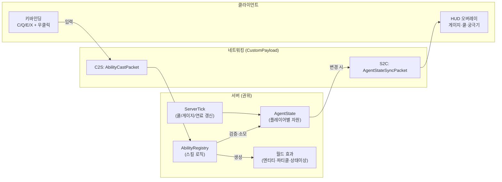
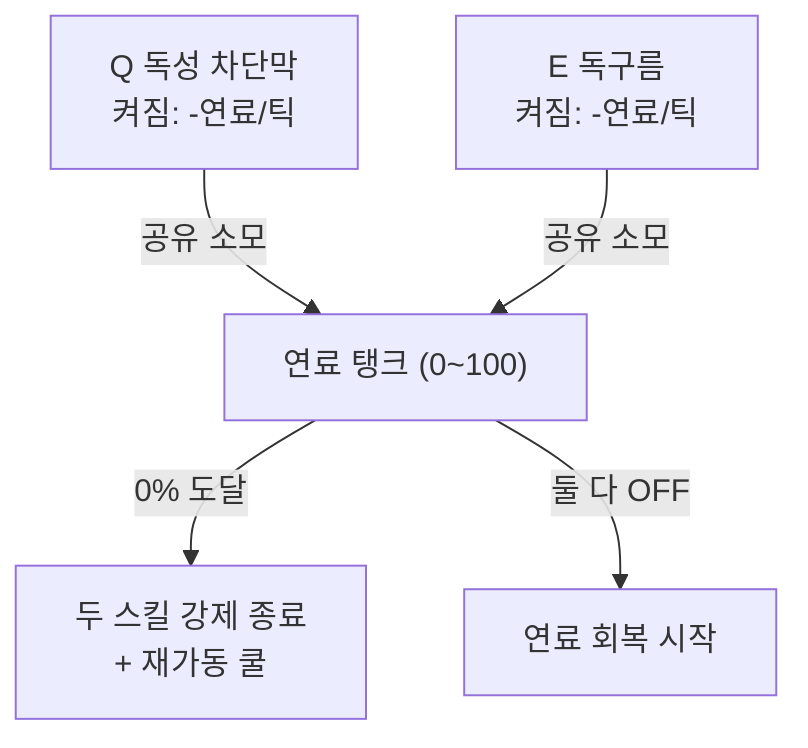
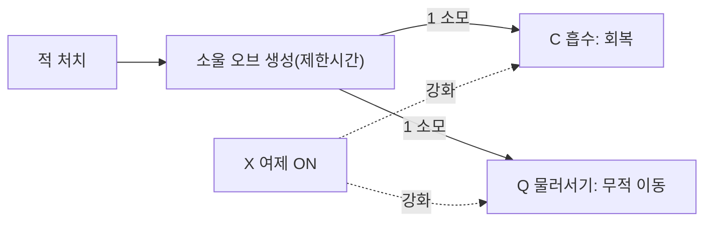
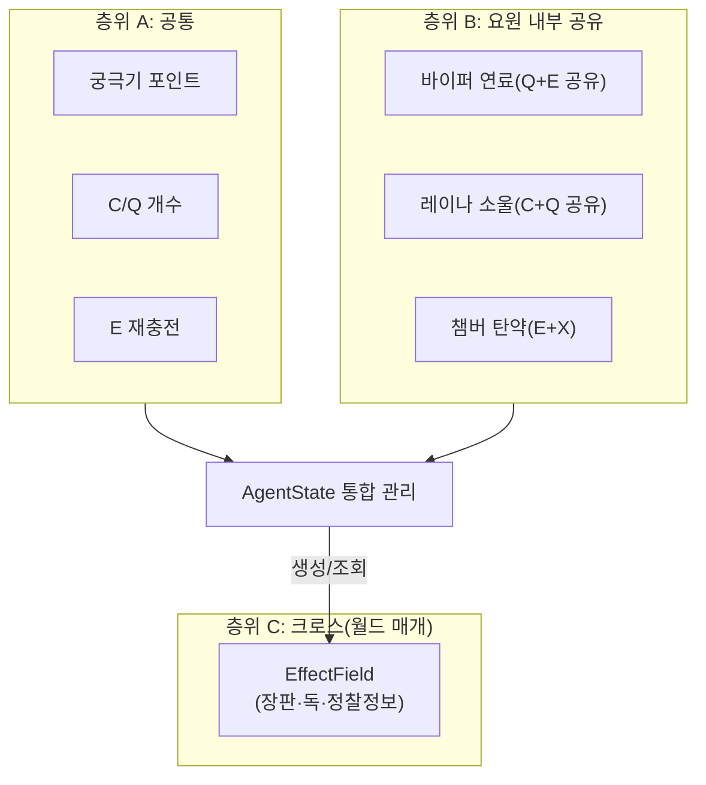
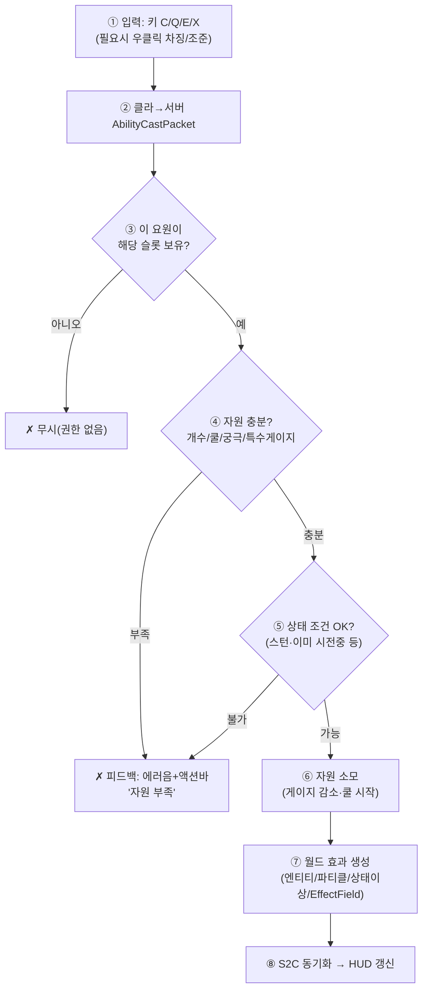
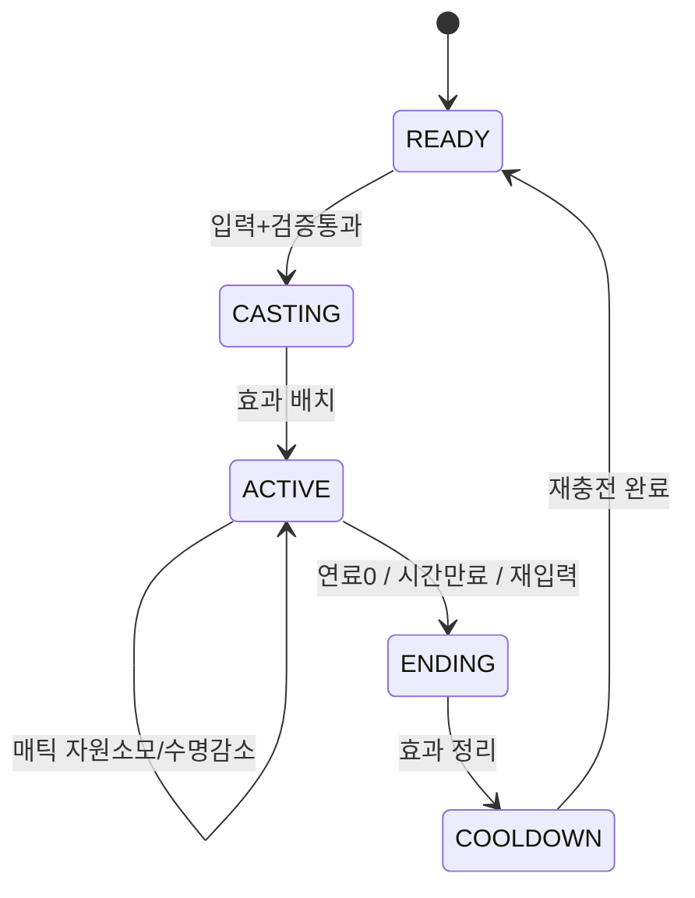
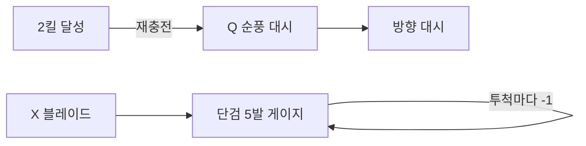
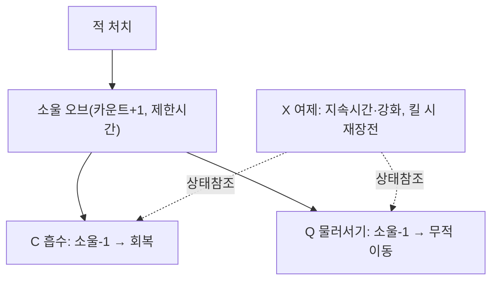
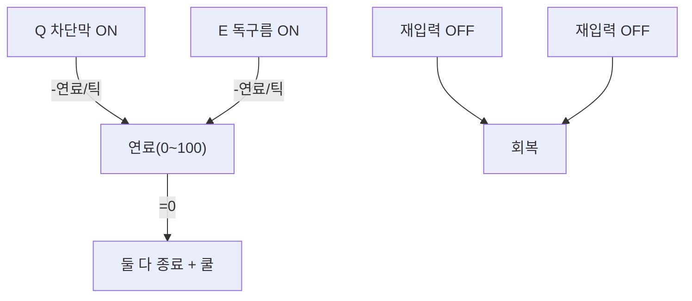
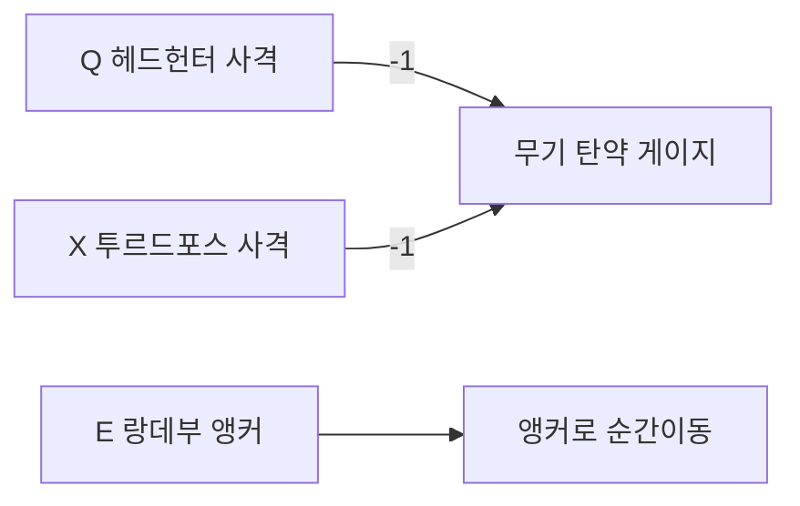

# 발로란트 스킬 마인크래프트 이식 기획서

> **플랫폼**: Fabric/Forge 모드 (클라이언트 + 서버 양쪽)
> **범위**: 역할군 대표 요원 (듀얼리스트·이니시에이터·컨트롤러·센티넬 각 3명, 총 12명)
> **핵심 요청**: 게이지(자원) 형식 요원의 자원 설계와 스킬 간 **연동(interlock)**, 그리고 각 요원의 **프리플로우(발동 흐름)**
> **작성 기준일**: 2026-08-18

---

## 0. 이 문서의 읽는 순서

1. **[1장] 목표와 설계 원칙** — 무엇을, 왜 이렇게 만드는가
2. **[2장] 기술 아키텍처** — Fabric 모드 구조 (자원·입력·네트워크·틱)
3. **[3장] 게이지(자원) 연동 설계** ← *가장 핵심.* 요청하신 "게이지 연동"의 본체
4. **[4장] 공통 프리플로우** — 모든 스킬이 공유하는 발동 상태머신
5. **[5장] 요원별 분석 & 프리플로우** — 12명 각각의 원작 분석 → MC 매핑 → 자원 → 발동 흐름
6. **[6장] 개발 로드맵**
7. **[7장] 데이터 구조 / 의사코드**
8. **[8장] 밸런싱·리스크**

---

## 1. 목표와 설계 원칙

### 1.1 목표
발로란트 요원의 스킬셋을 마인크래프트 전투(PvP/미니게임) 위에 이식한다. 총 대신 활·검·투척물 같은 MC 자원을 쓰되, **"스킬을 자원(게이지)으로 관리한다"는 발로란트의 정체성**을 그대로 옮기는 것이 핵심이다.

### 1.2 발로란트 스킬 구조 이해 (이식의 뼈대)
발로란트의 모든 요원은 아래 4슬롯 구조를 갖는다. 이 구조를 그대로 MC 키 4개로 매핑한다.

| 슬롯 | 원작 | 성격 | 자원 모델 | MC 매핑(기본) |
|------|------|------|-----------|----------------|
| **C** | 기본기 1 | 구매형·개수제 | **충전 개수(Charges)** — 라운드마다 재구매 | 키 `C`, 개수 게이지 |
| **Q** | 기본기 2 | 구매형·개수제 | **충전 개수(Charges)** | 키 `Q`(기본 `Z`), 개수 게이지 |
| **E** | 시그니처 | 무료·재충전형 | **쿨다운/재충전(Recharge)** 또는 특수 게이지 | 키 `E`(기본 `X`) |
| **X** | 궁극기 | 포인트 충전형 | **궁극기 포인트(Ult Points)** — 킬/오브/설치로 적립 | 키 `X`(기본 `V`) |

> **핵심 통찰**: 발로란트에는 3가지 "게이지"가 공존한다.
> ① **개수형**(C/Q, 정수 충전) ② **재충전형**(E, 시간/조건) ③ **포인트형**(X, 궁극기).
> 여기에 일부 요원은 ④ **특수 지속 게이지**(바이퍼 연료, 레이나 소울, 챔버 무기)를 얹는다.
> 이 **4계층 게이지 모델**이 전체 시스템의 중심축이다. → 3장 참조.

### 1.3 설계 원칙
- **서버 권위(Server-authoritative)**: 자원 소모·판정은 전부 서버에서. 클라는 입력 전송 + HUD 렌더만.
- **자원이 곧 밸런스**: 스킬 위력이 아니라 "게이지 회복 속도"로 밸런스를 잡는다(원작과 동일 철학).
- **연동 우선(Interlock-first)**: 스킬을 독립 구현하지 않고, 같은 요원의 스킬들이 하나의 자원 풀을 공유하거나 서로의 상태를 참조하도록 설계한다.
- **데이터 드리븐**: 요원/스킬 스펙을 JSON으로 분리해 코드 수정 없이 밸런싱한다.

---

## 2. 기술 아키텍처 (Fabric 모드)

### 2.1 전체 구조



### 2.2 구성 요소

**① AgentState (서버, 플레이어당 1개)**
플레이어가 선택한 요원과 모든 자원을 담는 상태 객체. Fabric에서는 다음 중 하나로 구현:
- 서버측 `HashMap<UUID, AgentState>` (가장 단순, MVP 권장)
- 또는 데이터 컴포넌트/`Cardinal Components` 라이브러리로 엔티티에 부착(퍼시스턴스·동기화 자동).

담는 값:
```
AgentState {
  agentId            // 선택 요원
  ultPoints          // 궁극기 포인트 (0..ultMax)
  cCharges, qCharges // C/Q 개수형 게이지
  eRecharge          // 시그니처 재충전 타이머(틱)
  special {          // 요원별 특수 게이지 (없으면 null)
    fuel             // 바이퍼: 연료 (0.0..100.0)
    soulOrbs         // 레이나: 소울 오브 개수
    weaponCharges    // 챔버: 헤드헌터/투르드포스 탄약
    ...
  }
  activeEffects[]    // 시전 중인 지속 스킬(연막·벽 등)의 핸들
}
```

**② AbilityRegistry (서버)**
`ResourceLocation(agentId, slot) → Ability` 매핑. 각 `Ability`는 아래 인터페이스 구현:
```
interface Ability {
  ResourceCost cost();               // 어떤 게이지를 얼마 쓰는가
  boolean canCast(AgentState, Player); // 자원·상태 검증
  void cast(AgentState, Player, World); // 효과 생성 + 자원 소모
}
```

**③ 입력 (클라)**
Fabric `KeyBindingHelper`로 C/Q/E/X 4키 + 보조(우클릭 조준/차징) 등록. 키 입력 → `AbilityCastPacket(slot, aimData)`를 서버로 전송. **클라는 절대 효과를 만들지 않는다**(치트·데싱크 방지).

**④ 네트워킹 (Fabric Networking API)**
- `C2S AbilityCastPacket { slot, yaw, pitch, chargeMs }`
- `S2C AgentStateSyncPacket { ultPoints, charges, recharge, special... }` — 값이 바뀔 때만 전송.

**⑤ HUD (클라, `HudRenderCallback`)**
화면 하단에 발로란트식 스킬 아이콘 + 게이지. 예: 궁극기 X/7, C·Q 개수, E 재충전 원형 게이지, 바이퍼 연료바 등. 순수 렌더링(상태는 S2C로 받은 값).

**⑥ ServerTick (`ServerTickEvents.END_SERVER_TICK`)**
매 틱마다 전 플레이어 순회:
- E 재충전 타이머 감소
- 특수 게이지 갱신(바이퍼 연료 소모/회복, 레이나 소울 만료 등)
- 지속 스킬(연막·벽) 수명 관리
- 변경분 있으면 S2C 동기화 예약

### 2.3 궁극기 포인트 적립(공통)
모든 요원 공유. 아래 이벤트에서 +1:
- 적 처치 / 스파이크(거점) 설치·해제 상당 행동 / **궁극기 오브** 픽업.
- **궁극기 오브**: 맵에 스폰되는 커스텀 아이템 엔티티(발로란트 오브 이식). 밟으면 +1.
- `ultMax`는 요원별로 다름(예: 6~8). 가득 차면 X 발동 가능.

---

## 3. 게이지(자원) 연동 설계 ★핵심

요청하신 "게이지 형식 요원의 연동"을 이 장에서 전부 설계한다. 연동은 **3층위**로 본다.

### 3.1 층위 A — 공통 게이지 (모든 요원 연동)
| 게이지 | 소유 | 적립 | 소모 |
|--------|------|------|------|
| 궁극기 포인트 | 전원 | 킬·오브·거점 | X 발동 |
| C/Q 개수 | 전원 | 라운드/시간 재보급 | 기본기 발동 |
| E 재충전 | 전원 | 시간 or 조건 | 시그니처 발동 |

→ 이 세 개는 **하나의 `AgentState`가 통합 관리**하고 HUD에 함께 표시. 서로 간섭은 없지만 "한 화면·한 상태"로 묶는 것이 첫 번째 연동.

### 3.2 층위 B — 요원 내부 게이지 연동 (같은 요원의 스킬끼리 자원 공유)
발로란트 "게이지 캐릭터"의 진짜 묘미. **한 자원 풀을 여러 스킬이 나눠 쓴다.**

#### ⓐ 바이퍼 — 연료(Fuel) 탱크 공유 ★대표
- **하나의 연료 탱크(0~100%)** 를 두 스킬이 **동시에** 빨아 먹는다.
  - `Q 독성 차단막(Toxic Screen, 벽)` 과 `E 독구름(Poison Cloud)` 이 **켜져 있는 동안 연료를 지속 소모**.
  - 둘 다 켜면 소모 2배 → 오래 못 버팀. **연료 배분이 곧 플레이**.
- 연료 0이 되면 두 스킬 모두 강제 종료 + **재가동 쿨다운**(연료 일정치까지 회복돼야 다시 켬).
- 스킬을 끄면(재입력) 연료 소모 정지 + 서서히 회복.


> **연동 포인트**: Q와 E는 코드상 **같은 `fuel` 변수를 read/write**. 독립 쿨다운이 아니라 **공유 자원 경쟁** 구조. 여기에 궁극기 `X 바이퍼 구덩이`도 켜져 있으면 데미지 상승 등 상태 참조로 추가 연동.

#### ⓑ 레이나 — 소울 오브(Soul Orb) 소모 ★대표
- 적 처치 시 **소울 오브 생성**(맵에 잠깐 남음). 이 오브가 **두 기본기의 공유 탄약**:
  - `C 흡수(Devour)`: 소울 1개 소모 → 즉시 체력 회복.
  - `Q 물러서기(Dismiss)`: 소울 1개 소모 → 잠깐 무적·재배치.
- 궁극기 `X 여제(Empress)` 켜지면 **소울 소모 방식이 바뀜**(오브 없이도 발동 가능/강화) — 상태 참조 연동.


> **연동 포인트**: 소울은 **킬(전투 결과)로만 충전**되는 게이지 → "잘 싸울수록 유지력↑"의 선순환. C와 Q가 **같은 오브 카운트**를 두고 경쟁.

#### ⓒ 챔버 — 무기 충전(Ammo) 게이지 ★대표
- `E 헤드헌터(권총)` / `X 투르드포스(저격)` 가 **탄약 게이지** 기반. 사격마다 탄 소모, 재구매/재충전으로 회복.
- `Q 순간이동 표식(랑데부)` 과 `C 함정(트립와이어)` 은 **설치물 위치**를 공유 참조(랑데부는 표식으로만 이동).

> **연동 포인트**: "무기형 게이지"는 MC에선 **커스텀 탄약 카운트**로. 사격 이벤트 → 게이지 -1 → 0이면 재장전 상태.

#### ⓓ 그 외 특수 게이지 요원(대표 로스터 외 참고)
- **네온**: 질주(E) 에너지 + 궁극 사격 지속시간이 하나의 에너지에서 나옴 → 바이퍼형 공유.
- **케이오(KAY/O)**: 과부하(Overload) 스택 / 전투 재조합(다운 후 부활 게이지).
- **하버**: 방벽 게이지. 위 패턴들의 변주라 같은 프레임워크로 커버 가능.

### 3.3 층위 C — 크로스(팀) 연동
서로 다른 요원의 스킬이 **월드 상태를 통해** 상호작용. (선택 구현, 재미 요소)
- **세이지 감속 장판 + 바이퍼 독구름**이 겹친 타일 → 이동불가+지속뎀 강한 시너지 존.
- **소바 정찰 화살**이 밝힌 적 위치를 **팀 HUD**에 공유(초기 3장의 S2C를 팀 브로드캐스트로 확장).
- **킬조이 경보기**가 울리면 팀 전체 액션바 알림.

> 구현 방식: 스킬은 월드에 **"효과 필드(EffectField)"** 엔티티/블록엔티티를 남기고, 다른 스킬은 자기 타일의 EffectField를 조회해 반응. 요원 간 직접 의존 없이 **월드를 매개로 느슨하게 연동**.

### 3.4 게이지 통합 규칙 (한 장 요약)



---

## 4. 공통 프리플로우 (스킬 발동 상태머신)

모든 스킬이 아래 **단일 파이프라인**을 통과한다. 요원별 프리플로우(5장)는 이 골격의 "효과" 단계만 다르게 채운다.



**지속형 스킬(연막·벽·연료계열)의 추가 상태**: 시전 후 `ACTIVE` 상태로 들어가 매 틱 자원 소모/수명 감소 → 조건(연료 0/시간 만료/재입력)에서 `END`로 전이하며 정리.



---

## 5. 요원별 분석 & 프리플로우 (역할군 대표 12명)

각 요원 항목 형식:
**원작 스킬 → MC 이식 → 자원(게이지) → 프리플로우 특이점**

---

### 5-A. 듀얼리스트 (타격대)

#### 5-A-1. 제트 (Jett) — 기동 딜러
| 슬롯 | 원작 | MC 이식 | 자원 |
|------|------|---------|------|
| C | 상승기류(Updraft) | 위로 도약(상방 속도 부여) | 개수 2 |
| Q | 순풍(Tailwind) | 바라보는 방향 대시(짧은 순간이동/가속) | 개수 1, **재충전(2킬당)** |
| E | 연막(Cloudburst) | 던진 위치에 시야차단 파티클 구름 | 개수 3 |
| X | 블레이드 스톰(Blade Storm) | 즉사급 투척 단검 5발(궁극) | 궁극 7 |
| **특이점** | Q 순풍이 **"2킬 시 재충전"** — 킬로 게이지가 도는 유일 구조. 궁극 단검은 **탄창형 카운트(5)** 로 5장 게이지 표시. |



#### 5-A-2. 레이즈 (Raze) — 폭발물 딜러
| 슬롯 | 원작 | MC 이식 | 자원 |
|------|------|---------|------|
| C | 부머봇(Boom Bot) | 직진하며 적 추적 폭발하는 소형 엔티티 | 개수 1 |
| Q | 블래스트 팩(Blast Pack) | 설치형 폭탄, 재기폭 시 자신 도약+범위뎀 | 개수 2 |
| E | 페인트 셸(Paint Shells) | 자탄이 튀는 광역 수류탄 | 재충전(킬로 가속) |
| X | 쇼스토퍼(Showstopper) | 로켓런처 직격 궁극 | 궁극 8 |
| **특이점** | Q 블래스트 팩은 **로켓점프식 기동**과 **딜**을 겸함 → 설치물+자기부여 연동. |

#### 5-A-3. 레이나 (Reyna) — 소울 게이지 딜러 ★게이지 대표
3.2ⓑ 참조. C 흡수 / Q 물러서기가 **소울 오브 공유**, X 여제로 소모 규칙 변경.



---

### 5-B. 이니시에이터 (척후대)

#### 5-B-1. 소바 (Sova) — 정찰
| 슬롯 | 원작 | MC 이식 | 자원 |
|------|------|---------|------|
| C | 올빼미 드론 | 조종 가능한 소형 정찰 엔티티(마킹 다트) | 개수 1 |
| Q | 충격 화살(Shock Bolt) | 착탄 범위 전기뎀 화살 | 개수 2 |
| E | 정찰 화살(Recon Bolt) | 착탄 후 주변 적 위치 **팀 HUD 노출**(EffectField) | 재충전 |
| X | 사냥꾼의 분노 | 벽 관통 추적 에너지 3발 궁극 | 궁극 8 |
| **특이점** | E 정찰 → **크로스 연동(3.3)** 의 핵심. 밝힌 정보를 팀 S2C 브로드캐스트. |

#### 5-B-2. 브리치 (Breach) — 관통 개시
| 슬롯 | 원작 | MC 이식 | 자원 |
|------|------|---------|------|
| C | 섬광탄(Aftershock)→실제론 지열탄 | 벽 관통 지연 폭발 장판 | 개수 1 |
| Q | 섬광(Flashpoint) | 벽 뒤에서 터지는 실명 섬광 | 개수 2 |
| E | 지진 균열(Fault Line) | 직선 범위 기절(느려짐/멀미) | 재충전 |
| X | 롤링 선더(Rolling Thunder) | 넓은 부채꼴 연쇄 기절 궁극 | 궁극 8 |
| **특이점** | 전부 **벽 관통 판정** 필요 → 레이캐스트 대신 "벽 무시 AoE" 로직 공용 모듈화. |

#### 5-B-3. 스카이 (Skye) — 회복형 개시
| 슬롯 | 원작 | MC 이식 | 자원 |
|------|------|---------|------|
| C | 조련사(Regrowth) | 팀 회복 게이지 소모형 힐 | **회복 게이지(소모형)** |
| Q | 사냥개(Trailblazer) | 조종 늑대, 적중 시 진탕 | 개수 1 |
| E | 안내자의 빛(Guiding Light) | 조종 매, 폭발 시 실명 | 재충전 |
| X | 계절(Seekers) | 적 3명 추적 표식 궁극 | 궁극 7 |
| **특이점** | C 힐이 **자체 소모 게이지**(다 쓰면 재충전) → 바이퍼 연료의 축소판. |

---

### 5-C. 컨트롤러 (전략가)

#### 5-C-1. 바이퍼 (Viper) — 연료 게이지 ★게이지 대표
3.2ⓐ 참조가 본체. 요약:
| 슬롯 | 원작 | MC 이식 | 자원 |
|------|------|---------|------|
| C | 독성 분사(Snake Bite) | 착탄 산성 장판(지속뎀+취약) | 개수 2 |
| Q | 독성 차단막(Toxic Screen) | 긴 독성 벽(연료 소모) | **연료 공유** |
| E | 독구름(Poison Cloud) | 재점화형 독 연막(연료 소모) | **연료 공유** |
| X | 바이퍼 구덩이(Viper's Pit) | 대형 독 지역, 시야·체력 침식 | 궁극 8 |
| **특이점** | **연료 탱크 하나를 Q·E가 공유**. 켠 만큼 소모, 0이면 강제 종료+재가동 쿨. |



#### 5-C-2. 브림스톤 (Brimstone) — 정통 연막
| 슬롯 | 원작 | MC 이식 | 자원 |
|------|------|---------|------|
| C | 자극제(Stim Beacon) | 설치 범위 내 아군 속도/공속 버프 | 개수 1 |
| Q | 소이탄(Incendiary) | 착탄 화염 장판(EffectField) | 개수 1 |
| E | 하늘 연막(Sky Smoke) | **미니맵 지정** 다중 연막 배치 | 개수 3(지도 UI) |
| X | 궤도 사격(Orbital Strike) | 지정 지역 지속 낙뢰/폭격 궁극 | 궁극 7 |
| **특이점** | E는 **지도 좌표 지정 UI** 필요 → 커스텀 화면(GUI)로 top-down 지정. |

#### 5-C-3. 오멘 (Omen) — 순간이동 연막
| 슬롯 | 원작 | MC 이식 | 자원 |
|------|------|---------|------|
| C | 편집증(Paranoia) | 직선 관통 근시(시야 축소) 투사체 | 개수 1 |
| Q | 어둠의 장막(Dark Cover) | 원거리 조준 연막 구체 | 개수 2, 재충전 |
| E | 어둠의 발걸음(Shrouded Step) | 근거리 순간이동 | 재충전 |
| X | 무에서(From the Shadows) | 맵 어디든 텔레포트 궁극 | 궁극 7 |
| **특이점** | E·X **텔레포트 좌표 지정**과 취소(재입력) 로직 공용화. |

---

### 5-D. 센티넬 (감시자)

#### 5-D-1. 사이퍼 (Cypher) — 정보/함정
| 슬롯 | 원작 | MC 이식 | 자원 |
|------|------|---------|------|
| C | 감시 카메라(Camera) | 설치형 원격 시점 카메라 엔티티 | 개수 1(회수 가능) |
| Q | 철사 덫(Trapwire) | 두 점 사이 와이어, 적 접촉 시 속박+노출 | 개수 2 |
| E | 사이버 감옥(Cyber Cage) | 시야차단+감속 케이지 | 재충전 |
| X | 신경 절도(Neural Theft) | 처치한 적 시체에서 전원 위치 폭로 궁극 | 궁극 7 |
| **특이점** | 설치물 **회수/재배치** 상태관리 + 트리거 감지(엔티티 충돌) 프레임워크. |

#### 5-D-2. 킬조이 (Killjoy) — 기계 방어
| 슬롯 | 원작 | MC 이식 | 자원 |
|------|------|---------|------|
| C | 경보 봇(Alarmbot) | 접근 적 추적·취약 부여 봇, 팀 경보 | 개수 1 |
| Q | 터렛(Turret) | 자동 조준 사격 포탑 엔티티 | 개수 1 |
| E | 나노스웜(Nanoswarm) | 위장 설치 후 원격 폭발 독장판 | 개수 2 |
| X | 봉쇄(Lockdown) | 넓은 범위 적 구속 궁극(설치·파괴가능) | 궁극 8 |
| **특이점** | 설치물이 **범위(레인지) 밖이면 비활성** — 위치 기반 상태 토글 필요. 크로스 연동(경보 → 팀 알림). |

#### 5-D-3. 챔버 (Chamber) — 무기 게이지 ★게이지 대표
3.2ⓒ 참조.
| 슬롯 | 원작 | MC 이식 | 자원 |
|------|------|---------|------|
| C | 트립와이어(Trademark) | 접근 감지 속박 함정 | 개수 1 |
| Q | 헤드헌터(Headhunter) | 고위력 커스텀 권총(탄약 게이지) | **탄약**, 라운드 구매 |
| E | 랑데부(Rendezvous) | 설치한 앵커로 순간이동 | 앵커 위치 참조, 재충전 |
| X | 투르드포스(Tour de Force) | 즉사 저격 소총 궁극(탄약 게이지) | 궁극 + **탄약** |
| **특이점** | Q·X가 **커스텀 무기 탄약 게이지**로 사격 관리. E는 C 앵커 위치와 연동. |



---

## 6. 개발 로드맵

| 단계 | 목표 | 산출물 | 검증 |
|------|------|--------|------|
| **M0 스켈레톤** | Fabric 모드 부팅, 요원 선택 명령어 | `AgentState`, 요원 선택 UI, 키 4개 등록 | `/agent set jett` 후 키 입력 로그 |
| **M1 공통 파이프라인** | 4장 발동 상태머신 + 네트워킹 + HUD | 궁극기 포인트 적립, C/Q 개수·E 재충전, HUD 게이지 | 더미 스킬로 자원 증감 확인 |
| **M2 게이지 3인방** | 바이퍼(연료)·레이나(소울)·챔버(탄약) | 3.2 연동 로직, 특수 게이지 HUD | 연료 공유·소울 공유·탄약 소모 실측 |
| **M3 나머지 요원** | 듀얼/이니/컨트/센티 대표 완성 | 12요원 스킬 로직, 설치물/투사체 모듈 | 요원별 프리플로우 통과 |
| **M4 크로스 연동** | EffectField 상호작용, 팀 HUD 공유 | 정찰 공유·장판 시너지 | 세이지×바이퍼 겹침 등 |
| **M5 밸런싱/데이터화** | JSON 스펙 분리, 수치 튜닝 | `data/agents/*.json`, 밸런스표 | 실전 테스트 |

**의존 순서**: M0 → M1 필수. M2는 M1 위에서 "특수 게이지"만 추가 → **연동 구조를 초기에 검증**하는 것이 리스크가 가장 큰 부분이라 앞으로 당김.

---

## 7. 데이터 구조 / 의사코드

### 7.1 요원 스펙 JSON (데이터 드리븐)
```jsonc
// data/valorant/agents/viper.json
{
  "id": "viper",
  "role": "controller",
  "ultMax": 8,
  "special": { "type": "fuel", "max": 100, "regenPerTick": 0.15 },
  "abilities": {
    "C": { "type": "aoe_dot", "charges": 2, "cost": { "kind": "charge" } },
    "Q": { "type": "wall_toggle", "cost": { "kind": "fuel", "drainPerTick": 0.5 } },
    "E": { "type": "smoke_toggle", "cost": { "kind": "fuel", "drainPerTick": 0.5 } },
    "X": { "type": "zone", "cost": { "kind": "ult" } }
  }
}
```

### 7.2 발동 파이프라인 (서버, 의사코드)
```java
void onCastPacket(ServerPlayer p, Slot slot, AimData aim) {
    AgentState st = states.get(p.getUUID());
    Ability ab = registry.get(st.agentId, slot);
    if (ab == null) return;                       // ③ 권한
    if (!ab.canCast(st, p)) { feedback(p, "부족"); return; } // ④⑤
    ab.consume(st);                               // ⑥ 자원 소모(개수/쿨/궁극/특수)
    ab.spawnEffect(p, aim, p.level());            // ⑦ 월드 효과
    sync(p, st);                                  // ⑧ HUD 동기화
}
```

### 7.3 연료 공유 틱 (바이퍼 연동 핵심)
```java
void serverTick(AgentState st) {
    if (st.special.type == FUEL) {
        double drain = 0;
        if (st.isActive(Slot.Q)) drain += spec.Q.drainPerTick; // 차단막
        if (st.isActive(Slot.E)) drain += spec.E.drainPerTick; // 독구름  → 둘 다면 2배
        if (drain > 0) {
            st.special.fuel -= drain;
            if (st.special.fuel <= 0) {           // 강제 종료 + 쿨
                st.special.fuel = 0;
                st.deactivate(Slot.Q); st.deactivate(Slot.E);
                st.startFuelCooldown();
            }
        } else if (!st.fuelOnCooldown()) {        // 둘 다 꺼짐 → 회복
            st.special.fuel = min(spec.max, st.special.fuel + spec.regenPerTick);
        }
    }
}
```
> **이 한 함수가 "게이지 연동"의 실체**: Q와 E가 각자 쿨을 갖는 게 아니라 **같은 `fuel`을 두고 경쟁**하도록 틱에서 합산 소모.

---

## 8. 밸런싱 · 리스크

### 8.1 밸런싱 레버 (수치는 전부 JSON)
- 궁극기 포인트 `ultMax`, 오브 스폰 빈도
- 특수 게이지: 연료 `drainPerTick`/`regenPerTick`, 소울 유지시간, 탄약 수
- C/Q 재보급 간격, E 재충전 시간
> 위력이 아니라 **회복 속도**로 조절(원작 철학 유지).

### 8.2 기술 리스크
| 리스크 | 영향 | 대응 |
|--------|------|------|
| 클라 예측 vs 서버 권위 데싱크 | 스킬 씹힘·중복 | 전부 서버 권위, 클라는 입력만. 낙관적 예측 지양 |
| 설치물/투사체 엔티티 과다 | TPS 저하 | 오브젝트 풀링·수명 캡·최대 개수 제한 |
| 벽 관통 판정(브리치/소바 궁) | 성능·정확도 | 공용 "AoE 벽무시" 모듈 1개로 통일 |
| 지도 지정 UI(브림스톤/오멘) | 구현 난이도 | 초기엔 조준 방향 착탄으로 대체, 후순위로 top-down GUI |
| 특수 게이지 동기화 빈도 | 트래픽 | 값 변경 시에만 S2C, 델타 압축 |

### 8.3 범위 밖(후속 확장)
- 대표 12명 외 나머지 요원(네온·케이오·하버·페이드·게코·아스트라·데드락 등)
- 스파이크(거점) 게임모드, 라운드/경제 시스템, 요원 3D 스킨·전용 사운드

---

## 부록. 대표 요원 요약표

| 역할 | 요원 | 게이지 특징 | 연동 핵심 |
|------|------|-------------|-----------|
| 듀얼 | 제트 | 궁극 단검 탄창형 | Q 킬재충전 |
| 듀얼 | 레이즈 | 개수형 | 설치+자기기동 |
| 듀얼 | **레이나** | **소울 오브 공유** | C·Q 소울 경쟁, X 규칙변경 |
| 이니 | 소바 | 재충전 | 정찰 팀 HUD(크로스) |
| 이니 | 브리치 | 개수/재충전 | 벽관통 공용 |
| 이니 | 스카이 | 회복 소모게이지 | 힐 게이지(연료 축소판) |
| 컨트 | **바이퍼** | **연료 탱크 공유** | Q·E 연료 경쟁, 0→강제종료 |
| 컨트 | 브림스톤 | 개수/지도지정 | EffectField 화염 |
| 컨트 | 오멘 | 재충전 | 텔레포트 공용 |
| 센티 | 사이퍼 | 개수/회수 | 트리거 감지 |
| 센티 | 킬조이 | 개수/범위토글 | 경보 팀알림(크로스) |
| 센티 | **챔버** | **무기 탄약 게이지** | Q·X 탄약, E 앵커 연동 |

---

*본 기획서는 발로란트 스킬을 Fabric 모드로 이식하기 위한 설계 문서다. 다음 실행 단계는 M0(스켈레톤) → M1(공통 파이프라인) → M2(게이지 3인방)이며, 특히 M2의 연료·소울·탄약 공유 로직을 초기에 검증하는 것을 권장한다.*
